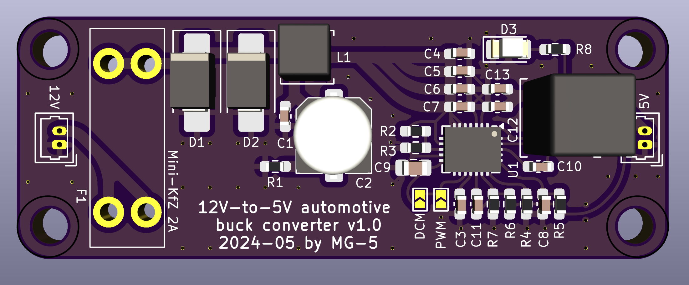

# buck-converter-automotive
12V to 5V 1A buck converter to automotive purposes

### Requirements for rev 1.0
* efficient step-down synchronous converter
* fuse
* TVS diodes
* reverse polarity protection
* LC input filter
* power-on LED

### Pictures (rev 1.0)

